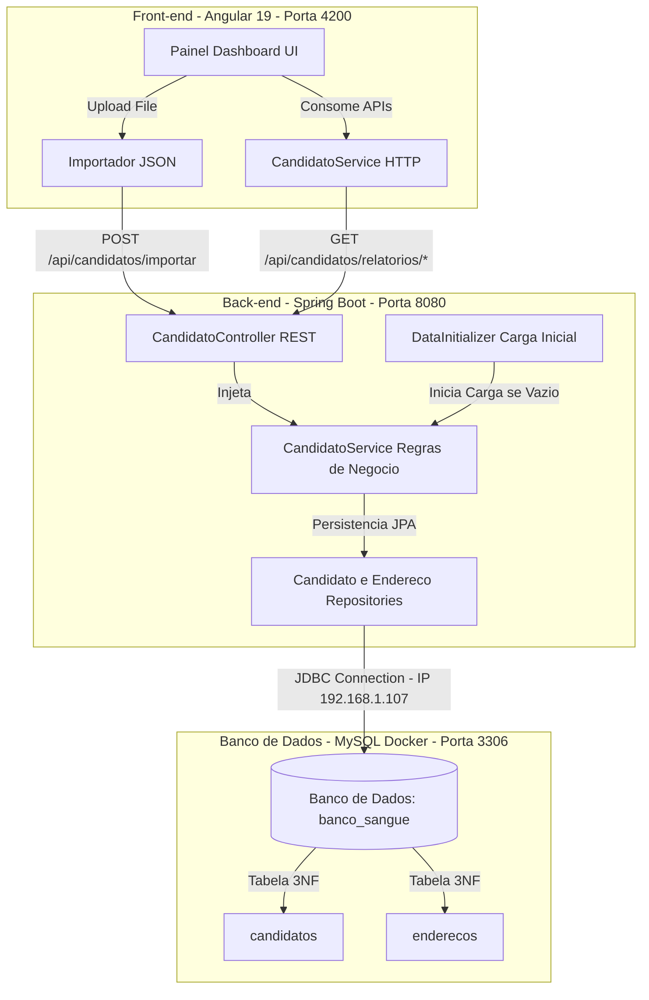

# 🩸 WK Banco de Sangue - Teste Técnico

Este projeto é a implementação do teste técnico para a **WK Technology**. Trata-se de um sistema completo para gestão, processamento e análise de dados de doadores de sangue, contendo um **Back-end em Spring Boot**, um **Front-end em Angular** e integração com banco de dados **MySQL**.

---

## 📁 Estrutura de Pastas do Projeto

O projeto é organizado de forma modular, dividindo as responsabilidades do back-end e front-end:

```text
testetrab/
├── backend/                  # API Rest em Spring Boot (Java)
│   ├── src/
│   │   ├── main/
│   │   │   ├── java/com/wk/sangue/
│   │   │   │   ├── config/       # Inicialização de dados (DataInitializer) e Swagger (OpenApiConfig)
│   │   │   │   ├── controller/   # Endpoints REST expostos
│   │   │   │   ├── dto/          # DTOs de envio de dados e relatórios
│   │   │   │   ├── model/        # Entidades persistentes (Candidato, Endereco)
│   │   │   │   └── repository/   # Repositórios JPA
│   │   │   └── resources/
│   │   │       ├── application.properties  # Parâmetros de conexão do MySQL
│   │   │       └── data.json     # Cópia do JSON para carga automática
│   │   └── test/                 # Testes unitários com JUnit 5 e Mockito
│   └── pom.xml               # Dependências do Maven (sem Lombok)
├── frontend/                 # Interface Web SPA em Angular 19
│   ├── src/
│   │   ├── app/
│   │   │   ├── services/         # CandidatoService para comunicação HTTP
│   │   │   ├── app.ts            # Lógica do painel e upload
│   │   │   ├── app.html          # HTML do Dashboard e Upload
│   │   │   └── app.config.ts     # Configurações do HttpClient
│   │   ├── index.html            # HTML de entrada do app
│   │   └── styles.css            # Estilos gerais e responsividade móvel
│   └── package.json          # Dependências do npm
├── data.json                 # Arquivo original fornecido no teste
└── README.md                 # Documentação e guia (este arquivo)
```

---

## 🛠️ Tecnologias Utilizadas

### Back-end
* **Java 17**
* **Spring Boot 3.3.0**
* **Spring Data JPA** (Persistência e relacionamento com Hibernate)
* **Maven** (Gerenciamento de dependências)
* **JUnit 5 & Mockito** (Testes unitários automatizados)
* *Observação: Nenhuma biblioteca externa como Lombok foi utilizada (conforme requisitos de código explícito).*

### Front-end
* **Angular 19** (Estrutura standalone moderna)
* **TypeScript**
* **HTML5 & CSS3** (Vanilla CSS com design premium e responsivo)

### Banco de Dados
* **MySQL 8** (Rodando localmente em ambiente Docker)

---

## 📐 Arquitetura do Sistema

O diagrama abaixo ilustra o fluxo de dados e a arquitetura geral da aplicação:



---

## 🗄️ Modelagem do Banco de Dados e Normalização (3NF)

Para demonstrar conhecimento técnico e boas práticas exigidas pelo teste, a base de dados não foi estruturada de forma plana (tabela única). Aplicou-se a **Terceira Forma Normal (3NF)** para separar a localidade e dados residenciais das informações pessoais dos candidatos:

1. **Tabela `enderecos`**: Armazena os dados de localidade indexados por CEP.
2. **Tabela `candidatos`**: Armazena os dados do candidato e possui uma chave estrangeira (`endereco_id`) apontando para seu respectivo endereço, gerando um relacionamento de um para um (`@OneToOne`).
3. **Integridade e Desempenho**:
   * O campo `cpf` possui uma restrição de unicidade (`UNIQUE`) e índice dedicado (`idx_cpf`) para agilizar as consultas por CPF e evitar duplicidade de registros na importação do JSON.

---

## 🚀 Como Executar o Projeto

### Pré-requisitos
* Java 17 ou superior instalado.
* Node.js v23 ou superior instalado.
* Servidor MySQL ativo e disponível em rede (o projeto está pré-configurado para se conectar no IP `192.168.1.107` com o usuário `nsouzaet_root` e a senha `#Nso196840`).

---

### 1. Inicializar o Banco de Dados
Certifique-se de que o seu contêiner MySQL Docker esteja rodando no IP `192.168.1.107` com a porta padrão `3306` aberta.
* *Nota: O projeto do Spring Boot está configurado com `createDatabaseIfNotExist=true` na string de conexão JDBC. O banco de dados chamado `banco_sangue` e suas tabelas correspondentes serão criados de forma totalmente automatizada no primeiro início do servidor.*

---

### 2. Executar o Back-end (Spring Boot)
Navegue até a pasta do backend e execute a aplicação utilizando o wrapper Maven:

```bash
cd backend
mvn spring-boot:run
```

A API estará disponível no endereço: `http://localhost:8080`.

#### Rodar os Testes Unitários:
```bash
cd backend
mvn clean test
```

---

### 3. Executar o Front-end (Angular)
Navegue até a pasta do frontend, certifique-se de que as dependências do npm estão instaladas e inicie o servidor do Angular:

```bash
cd frontend
npm start
```

O painel web estará disponível em: `http://localhost:4200` no seu navegador.

---

## 📊 Endpoints da API REST

A API do backend disponibiliza os seguintes endpoints sob a base `/api/candidatos`:

* `POST /importar`: Recebe um array JSON de candidatos (ex: `data.json`) e insere novos candidatos na base, ignorando CPFs duplicados.
* `GET /relatorios/estado`: Quantidade de candidatos por estado brasileiro.
* `GET /relatorios/imc-faixa-etaria`: IMC médio em faixas etárias de 10 anos (0-10, 11-20, 21-30, etc.).
* `GET /relatorios/percentual-obesos`: Percentual de obesos entre homens e mulheres (IMC > 30).
* `GET /relatorios/idade-tipo-sanguineo`: Média de idade para cada um dos 8 tipos sanguíneos.
* `GET /relatorios/doadores-por-receptor`: Quantidade de doadores possíveis e compatíveis para cada tipo de receptor (aplicando filtros de peso > 50kg e idade entre 16 e 69 anos).

---

## 📖 Documentação Interativa da API (Swagger / OpenAPI)

Com o backend ativo, você pode explorar, visualizar e testar todas as rotas e relatórios de forma interativa através do **Swagger UI**:

* **Swagger UI:** [http://localhost:8080/swagger-ui/index.html](http://localhost:8080/swagger-ui/index.html)
* **JSON da especificação OpenAPI:** [http://localhost:8080/v3/api-docs](http://localhost:8080/v3/api-docs)
